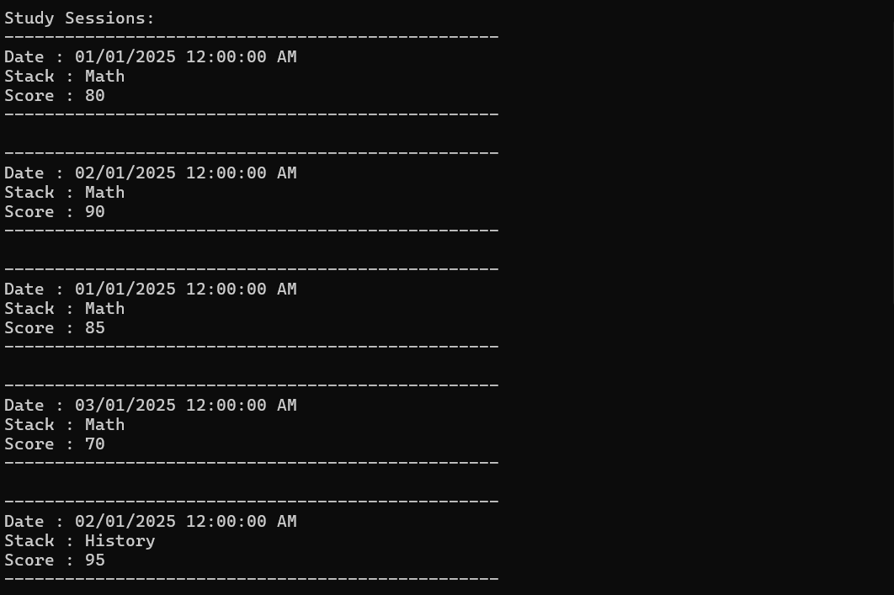
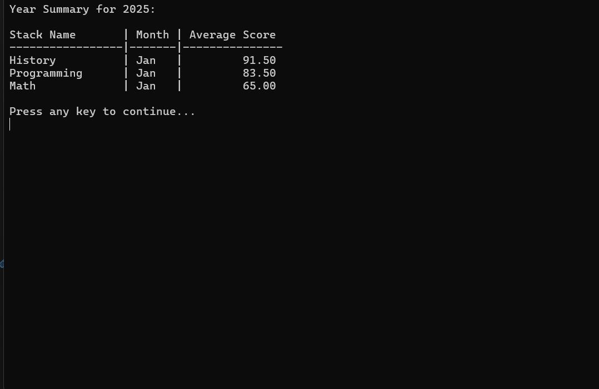

# Flashcards App

## Overview
The **Flashcards App** is a console-based C# application designed to help users create, manage, and study flashcards efficiently. It leverages **SQL Server** for data persistence and introduces concepts like relational database design, cascade deletes, and Data Transfer Objects (DTOs).

This project demonstrates how to build a functional and structured application using modern C# practices while integrating a database to store and manage data.

---

## Features
### 1. Flashcards Management
- Create and manage stacks of flashcards.
- Ensure stack names are unique.
- Flashcards are tied to stacks, and deleting a stack removes all associated flashcards.
- Display flashcards with sequential IDs starting from `1`, with no gaps even after deletions.

### 2. Study Sessions
- Study specific stacks and record session scores.
- Each session includes the **date** and **score**.
- Study session data is stored in the database and linked to the corresponding stack.
- Sessions can only be inserted—no updates or deletions allowed.

### 3. Yearly Summary
- View a summary of study sessions for a specific year.
- The summary displays:
  - Stack names
  - Average scores for each month
  - Months displayed in a user-friendly format (e.g., "Jan," "Feb").
- Analyze study trends over time.

---

## Technologies Used
- **Programming Language**: C#
- **Database**: SQL Server
- **Key Concepts**:
  - Relational Database Design (tables with foreign keys)
  - Cascade Deletes
  - DTOs for data transformation and presentation
  - Grouping and pivoting data in SQL and LINQ
  - Modular application design

---

## How It Works
1. **Flashcards Module**:
   - Users can create stacks and add flashcards to them.
   - Flashcards are automatically renumbered when items are removed.
   
2. **Study Sessions Module**:
   - Users can study a stack, and their session details are recorded.
   - Study session scores are stored with timestamps.

3. **Year Summary Module**:
   - Users can input a year to view the average scores for each stack, broken down by month.

---

## Installation and Usage
### Prerequisites
- Install .NET SDK (at least version 6.0).
- Set up SQL Server and create the required database schema.

### Steps to Run the Application
1. Clone this repository:
   ```bash
   git clone https://github.com/Eyad-Mostafa/FlashCards.git
   cd flashcards-app
   ```
2. Configure the connection string in the project file to point to your SQL Server instance.
3. Build and run the application:
   ```bash
   dotnet run
   ```
4. Follow the on-screen instructions to manage flashcards and study sessions.

---

## Key Learnings
This project emphasizes:
- Building database-driven applications using C# and SQL Server.
- Implementing relational database concepts with foreign keys and cascade deletes.
- Using DTOs to separate database schema from user-facing data.
- Querying and transforming data with LINQ and SQL for advanced use cases.

---

## Demo

### Main Menu
  
This is the main menu where users can navigate through the application's various features.

### Manage Stacks
  
The interface for managing stacks. Users can add, view, or delete stacks from here.

### Viewing Stacks
  
A detailed view of the available stacks, displaying their unique names.

### Study Sessions
  
Displays all recorded study sessions. **Note:** The time in this screenshot is `12:00:00 AM` because SQL was used to insert test data for a larger sample. During actual usage, the application records the real session time.

### Yearly Summary
  
A summary of the study sessions for a specific year, grouped by stacks and showing the average scores for each month.

---
